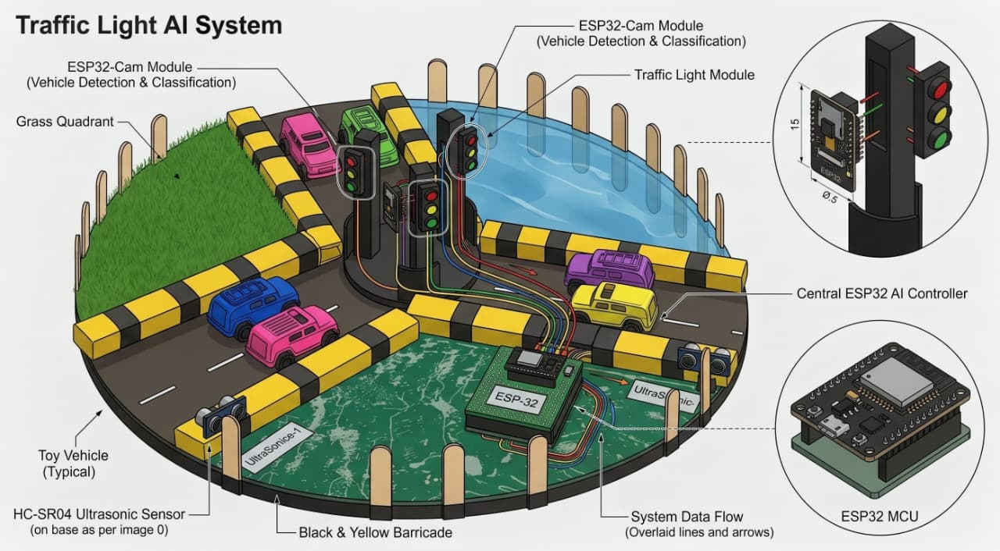
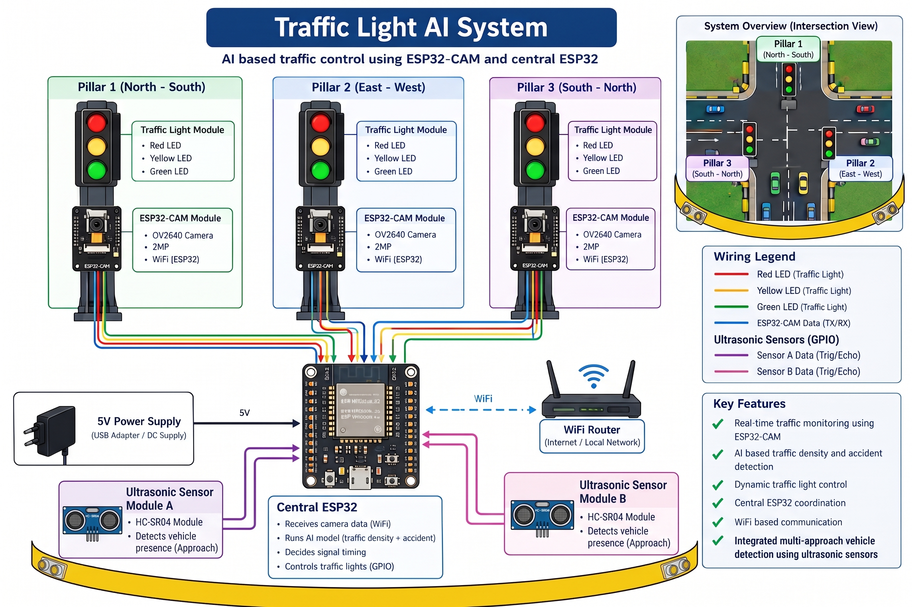
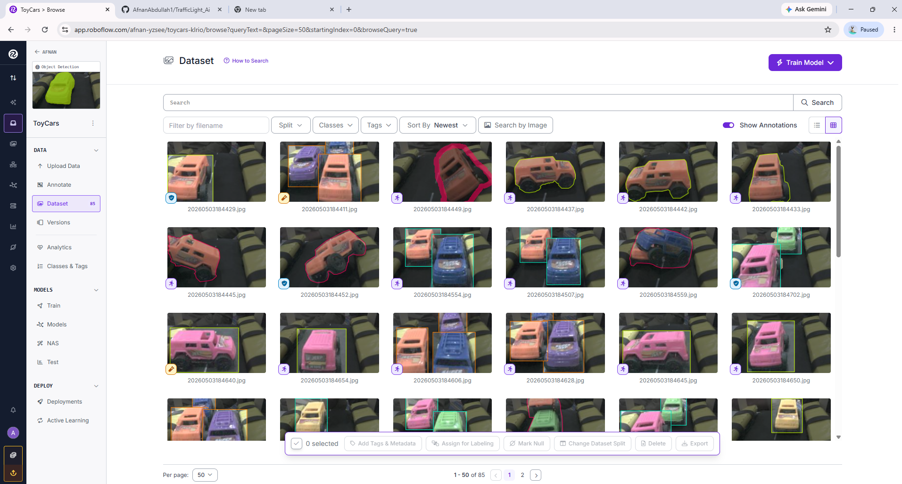
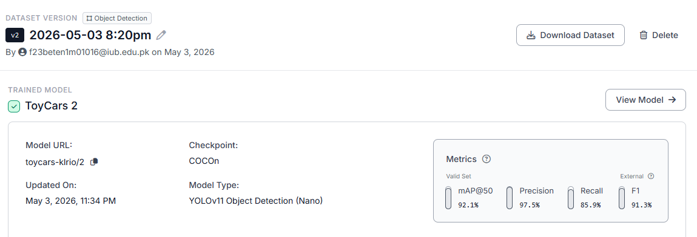

# 🚦 AI Smart Traffic Light Control System

[](https://www.python.org/)
[](https://flask.palletsprojects.com/)
[](https://docs.ultralytics.com/)
[](https://opencv.org/)
[](https://www.espressif.com/)
[](LICENSE)

> A smart, hybrid traffic management system that uses **YOLOv8 AI cameras** and **hardware ultrasonic sensors** to detect traffic density in real time, dynamically give more green light time to busy lanes, and automatically turn all lights **RED** if an accident happens.

---

## 📸 Project Gallery

| 🖥️ Live Web Dashboard | 🛠️ Hardware Setup & Model |
| :---: | :---: |
|  |  |
| *Real-time video feeds, AI car counts & signal controls* | *3-lane physical intersection with ESP32 & LEDs* |

*(Drop `dashboard_preview.png` into [`Images/`](Images/) to show your web dashboard screenshot)*

---

## 💡 What is this Project?

Normal traffic lights change on rigid, fixed timers. Even when a road is completely empty, it stays green while busy lanes stay stuck in traffic.

**This project solves that using Dual-Layer Sensing (AI Vision + Ultrasonic Telemetry):**
- **👀 AI Cameras (Lane Eyes):** 3 ESP32-CAMs stream live video of each lane to a central laptop.
- **🧠 YOLOv8 AI (Brain):** Detects vehicle density and classifies cars in real time.
- **📡 Ultrasonic Proximity Sensors (Physical Verification):** HC-SR04 sensors measure vehicle distance at each lane entrance to count cars physically.
- **⏱️ Dynamic Green Light Timing:**
  - **1 Car:** 5 seconds green
  - **2 Cars:** 7 seconds green
  - **3+ Cars (Heavy Traffic):** 10 seconds green
- **🚨 Instant Accident Safety:** If a crash happens, the AI immediately trips an **All-Red safety stop** across all lanes to protect motorists.
- **📶 No IP Address Hassle:** Uses **mDNS** hostnames (`traffic-esp.local`, `cam-lane1.local`), so you never need to copy-paste new IP addresses when switching Wi-Fi.

---

## 🏗️ System Flow & Architecture

<p align="center">
  
</p>

```
        📷 3x ESP32-CAMs                   💻 Laptop / PC                    🚦 ESP32 Controller
   (Watching 3 Traffic Lanes)           (Running YOLOv8 + Flask)             (Controls 9x LEDs & Sensors)
  ┌──────────────────────────┐         ┌──────────────────────────┐         ┌──────────────────────────┐
  │  cam-lane1.local         │         │   1. Receives video      │         │   1. Changes Red/Yellow/ │
  │  cam-lane2.local         ├────────►│   2. YOLOv8 counts cars  ├────────►│      Green LEDs          │
  │  cam-lane3.local         │  Video  │   3. Calculates green    │  HTTP   │   2. Ultrasonic sensors  │
  └──────────────────────────┘  Stream │      timer (5s / 7s / 10s│ Command │      physically count    │
                                       │   4. Hosts Web Dashboard │         │      incoming cars (<5cm)│
                                       └──────────────────────────┘         │   traffic-esp.local      │
                                                                            └──────────────────────────┘
```

---

## 📡 Ultrasonic Sensors & Dual-Layer Car Counting

In addition to computer vision, the system integrates **3× HC-SR04 ultrasonic distance sensors** directly onto the master ESP32 controller.

### ❓ Why use Ultrasonic Sensors with Cameras?
Cameras can suffer from bad lighting, lens obstructions, or network lags. Ultrasonic sensors provide a **hardware-level second layer of truth**:
- **Sonic Wave Detection:** Emits a 10µs ultrasonic pulse and measures echo reflection time (`Distance = Time × 0.034 / 2 cm`).
- **Proximity Trigger:** When a car gets closer than **5 cm** (`DIST_THRESHOLD`), the sensor registers a vehicle arrival.
- **Smart Anti-Double-Count Logic:** If a car stops in front of the sensor waiting at a red light, a software state latch (`carPresent`) prevents it from repeatedly incrementing. Only after the car drives away does it reset for the next vehicle.
- **Live Telemetry & Dashboard Sync:** Counts are transmitted over Wi-Fi to the Flask dashboard with live color badges:
  - 🔵 **0 Cars:** Low traffic (`sensor-low`)
  - 🟢 **1–3 Cars:** Medium traffic (`sensor-med`)
  - 🟡 **4+ Cars:** High traffic warning (`sensor-high`)
- **Remote Zeroing:** Features a 1-click **"🔄 Reset All Counters"** button on the web dashboard that calls `/reset_sensor` to clear counts both in memory and on the physical ESP32.

```
       HC-SR04 Sensor                      ESP32 WROOM Controller
    ┌──────────────────┐                     ┌──────────────────┐
    │  VCC (5V)        ├─────────────────────┤ 5V (VIN)         │
    │  TRIG (Trigger)  ├─────────────────────┤ GPIO 13 / 14 / 15│
    │  ECHO (Echo)     ├──[ 1kΩ Resistor ]───┤ GPIO 12 / 27 / 32│
    │  GND (Ground)    ├─────────────────────┤ GND              │
    └──────────────────┘                     └──────────────────┘
```

---

## 🛠️ Hardware Specifications

| Component | Qty | Role |
| :--- | :---: | :--- |
| **ESP32 WROOM** | 1 | Master controller — drives 9 signal LEDs & polls ultrasonic sensors |
| **ESP32-CAM (AI-Thinker)** | 3 | Dedicated camera nodes — streams live MJPEG video per lane |
| **Traffic Light Modules** | 3 | Road A (Lane 1), Road B (Lane 2), Road C (Lane 3) LEDs |
| **HC-SR04 Sensors** | 3 | Ultrasonic sensors for physical vehicle presence verification |

### 📌 Wiring Pinout (ESP32 WROOM)

| Lane | 🔴 Red LED | 🟡 Yellow LED | 🟢 Green LED | 📡 Ultrasonic TRIG | 📡 Ultrasonic ECHO |
| :--- | :---: | :---: | :---: | :---: | :---: |
| **Lane 1 (Road A)** | GPIO 23 | GPIO 22 | GPIO 21 | **GPIO 13** | **GPIO 12** |
| **Lane 2 (Road B)** | GPIO 19 | GPIO 18 | GPIO 5  | **GPIO 14** | **GPIO 27** |
| **Lane 3 (Road C)** | GPIO 26 | GPIO 25 | GPIO 4  | **GPIO 15** | **GPIO 32** |

> 📖 **Full Hardware Guide:** See [docs/HARDWARE_GUIDE.md](docs/HARDWARE_GUIDE.md) for step-by-step assembly and breadboard diagrams.

---

## 🚀 Quick Start (Run in 3 Steps)

### 1. Clone & Install Dependencies
```bash
git clone https://github.com/AfnanAbdullah1/TrafficLight_Ai.git
cd TrafficLight_Ai

# Create virtual environment (recommended)
python -m venv venv
.\venv\Scripts\activate   # On Windows

# Install required libraries
pip install -r requirements.txt
```

### 2. Set Up Wi-Fi
Open `firmware/wifi_config.h` and write your Wi-Fi or Hotspot name and password:
```cpp
#define WIFI_SSID "YourWiFiName"
#define WIFI_PASS "YourPassword"
```
*(Upload firmware to ESP32 boards using Arduino IDE. Full guide: [docs/MDNS_SETUP.md](docs/MDNS_SETUP.md))*

### 3. Start the System
```bash
python app.py
```
*Or simply double-click `scripts/start_system.bat` on Windows.*

👉 Open your browser at **`http://localhost:5000`** and click **"Connect All"**!

---

---

## 🎮 Comprehensive Web Dashboard Features

The web dashboard functions as a centralized mission control center accessible from any **laptop, desktop, tablet, or smartphone**:

### 1. 📱 Full Mobile & Remote Control
- **Cross-Platform Responsive UI:** Access directly on your phone browser by connecting to the same Wi-Fi hotspot (`http://<PC-IP>:5000`) or from anywhere in the world using **Ngrok / Cloudflare** tunnels.
- **Touch-Friendly Controls:** Change signal phases, adjust lane timers, trigger emergency halts, and monitor live AI camera streams directly from your mobile screen.

### 2. 🎛️ Manual Route Control
- **Switch to Manual Mode:** Toggle between autonomous AI sequencing and manual operator control at any moment (`setMode('manual')` or key `M`).
- **Direct Signal Override:** Force any specific lane (Lane 1, 2, or 3) to 🟢 **GREEN**, 🟡 **YELLOW**, or 🔴 **RED** with a single click.
- **Lane-by-Lane Adjustments:** Use `+` and `−` incremental buttons to add or subtract seconds for specific lanes on the fly.

### 3. 🚨 Emergency Alert & Priority Route Override
- **🛑 Stop All (All Red):** One-tap button immediately turns all 3 lanes RED, halting all intersection traffic during critical emergencies.
- **🚑 Open Priority Route:** Instantly open an emergency green corridor for **Lane 1**, **Lane 2**, or **Lane 3** (ideal for ambulances, fire trucks, or police) while locking all conflicting lanes in RED.
- **⏱️ +5s to Current Green:** Tap anytime to extend the active green light by +5 seconds for passing convoys or heavy vehicles before changing.
- **✅ Clear Emergency:** Safely resumes standard sequencing with a single tap or pressing `Esc`.

### 4. 🔄 Default Sequence vs. Traffic Density Timing
- **Default Sequence Timing:** When traffic flow is balanced, the system runs in a smooth round-robin sequence (5s green per lane).
- **Congestion-Adaptive Jam Relief:** If vehicle queues grow in any lane, the green timer automatically extends to clear the bottleneck:
  - 🚗 **1 Car:** 5 seconds (standard sequence)
  - 🚗🚗 **2 Cars:** 7 seconds (+2s extension)
  - 🚗🚗🚗 **3+ Cars (Heavy Traffic / Jam):** 10 seconds (+5s extension)
- **Timing Presets:** One-click presets for ⚡ **Default (5s)**, ⚖️ **Equal (5s)**, and ⚙️ **Custom Timing** inputs to enter exact seconds for every road.

### 5. 📡 Ultrasonic Sensor Live Telemetry
- Real-time vehicle counting per lane powered by HC-SR04 proximity distance sensors.
- Color-coded traffic density badges:
  - 🔵 **0 Cars:** Low Traffic (`sensor-low`)
  - 🟢 **1–3 Cars:** Moderate Traffic (`sensor-med`)
  - 🟡 **4+ Cars:** Heavy Traffic Alert (`sensor-high`)
- **🔄 Reset All Counters:** One-click button to reset hardware and dashboard car counts back to zero.

### 6. ⌨️ Keyboard Shortcuts
| Key | Action |
| :---: | :--- |
| `1` / `2` / `3` | Force Green light on Lane 1 / Lane 2 / Lane 3 |
| `A` | Switch to Automatic AI Sequence Mode |
| `M` | Switch to Manual Operator Mode |
| `D` | Reset to Default Timing (5s each) |
| `E` | Set Equal Timing across all lanes |
| `Esc` | Clear Emergency & Resume Normal Operations |

---

## 🧠 AI Model & Custom Training Pipeline

The computer vision engine is powered by **Ultralytics YOLOv8**, fine-tuned on a custom dataset specifically built for this physical intersection setup.

<p align="center">
  
</p>

### 🔄 End-to-End ML Pipeline (From Scratch)

1. **📸 Image Collection via ESP32-CAM:**
   - Captured real images using the **exact same ESP32-CAM modules** mounted on the physical intersection model.
   - Capturing frames from the hardware perspective eliminated camera lens distortion and lighting mismatch (zero domain shift).

2. **🏷️ Annotation & Augmentation on Roboflow:**
   - Uploaded the collected image dataset to [Roboflow Universe](https://universe.roboflow.com/afnan-yzsee/toycars-klrio/dataset/2).
   - Annotated bounding boxes across 4 custom classes:
     - 💥 **`Accident`**: Detects collisions or overturned vehicles to trigger emergency safety stops.
     - 🚗🚗🚗 **`ThreeCar`**: Detects 3 vehicles (heavy congestion).
     - 🚗🚗 **`TwoCar`**: Detects 2 vehicles (moderate congestion).
     - 🚗 **`OneCar`**: Detects a single vehicle (light traffic).
   - Applied pre-processing and data augmentations (random rotations ±15°, brightness changes ±15%, and horizontal flips) to produce 220+ training samples.

3. **⚡ GPU Model Training on Google Colab:**
   - Exported the YOLOv8-formatted dataset directly into **Google Colab** with GPU acceleration.
   - Trained the model for multiple epochs until loss converged and precision/recall peaked.
   - Extracted the optimal weights checkpoint [`models/best.pt`](models/best.pt) and integrated it into the central Flask inference worker.

<p align="center">
  
</p>

### 🎯 Detection Classes & Dynamic Signal Logic

| Class | Traffic Condition | Signal Duration | Action Triggered |
| :--- | :---: | :---: | :--- |
| **`Accident`** | 💥 Collision / Hazard | Immediate | **All-Red Safety Stop** on all lanes (<100ms) |
| **`ThreeCar`** | 🚗🚗🚗 Heavy Traffic | **10 Seconds** | Extended Green phase |
| **`TwoCar`** | 🚗🚗 Moderate Traffic | **7 Seconds** | Standard Green phase |
| **`OneCar`** | 🚗 Light Traffic | **5 Seconds** | Baseline Green phase |
| **`None`** | Empty Lane | Baseline (5s) | Proceeds to next lane in sequence |

---

## 📁 Project Structure

```
TrafficLight_Ai/
├── app.py                     # Main Python Flask server + YOLO AI logic
├── requirements.txt           # Python packages list
├── LICENSE                    # MIT License
├── README.md                  # This file
│
├── Images/                    # Flow diagrams, hardware & training screenshots
│   ├── FlowDiagram.jpg        # System architecture and workflow diagram
│   ├── HardwareDesign.jpeg    # Physical intersection model & hardware photo
│   ├── RoboFlow_mainInterface.png # Roboflow dataset annotation & classes interface
│   └── RoboFlow_ModelAnalytics.png # Training metrics & loss curves
│
├── models/
│   └── best.pt                # Custom trained YOLOv8 model
│
├── templates/
│   └── index.html             # Web dashboard user interface
│
├── firmware/                  # Arduino code for microcontrollers
│   ├── wifi_config.h          # Wi-Fi settings
│   ├── traffic_controller/    # ESP32 WROOM code (LEDs & HC-SR04 Sensors)
│   └── CameraWebServer/       # ESP32-CAM code (mDNS video stream)
│
├── data/                      # Dataset files & annotations
│
├── docs/                      # Detailed Guides
│   ├── HARDWARE_GUIDE.md      # Physical wiring & ultrasonic instructions
│   ├── MDNS_SETUP.md          # mDNS setup (no IP paste needed)
│   ├── DEPLOYMENT_GUIDE.md    # Remote internet access (Ngrok/Cloudflare)
│   ├── Full_Project_Description.pdf
│   └── Traffic_AI_Overview.pdf
│
└── scripts/
    └── start_system.bat       # One-click launcher for Windows
```

---

## 💼 CV / Resume Ready Points

You can copy and paste these points into your CV / Resume under **Projects**:

- **AI Smart Traffic Light System (Computer Vision & IoT Sensor Fusion)**
  - Architected an adaptive 3-lane intersection controller using **YOLOv8** and **ESP32 microcontrollers**, dynamically modulating green light phase durations based on real-time vehicle density.
  - Curated a custom intersection dataset using **ESP32-CAMs**, labeled across 4 traffic classes on **Roboflow**, and trained an optimized **YOLOv8** detector on **Google Colab (GPU)** to produce production-grade edge inference weights (`best.pt`).
  - Implemented a **dual-modal sensing pipeline** combining computer vision vehicle tracking with hardware-level **HC-SR04 ultrasonic distance sensors** for fail-safe vehicle counting and proximity verification.
  - Built an automated accident-detection protocol that triggers an emergency all-red stop in **<100ms** to prevent secondary collisions upon detecting a vehicle crash.
  - Configured zero-touch **mDNS** networking (`.local` resolution) for seamless plug-and-play node synchronization across changing Wi-Fi environments.
  - Developed a full-stack **Flask** web dashboard featuring low-latency MJPEG video streaming, live ultrasonic telemetry, manual overrides, and secure remote tunneling via **Ngrok / Cloudflare**.

---

## 📄 Documentation Links

- 🔧 [Step-by-step Hardware Wiring & Ultrasonic Guide](docs/HARDWARE_GUIDE.md)
- 📡 [mDNS Wi-Fi Setup Guide](docs/MDNS_SETUP.md)
- 🌐 [Remote Internet Access Guide](docs/DEPLOYMENT_GUIDE.md)
- 📑 [Full Project Report (PDF)](docs/Full_Project_Description.pdf)

---

## 📜 License

This project is licensed under the [MIT License](LICENSE).
